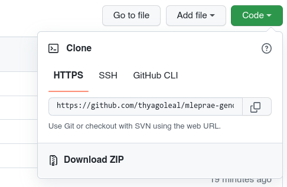

# :computer: Workflow for bacterial genomics 

## About

This workflow takes in unprocessed fastq.gz files from short-read sequencers then pre-process, map, and call variants against the *M. leprae* genome TN reference (pre-configured). The original workflow was built upon python2 code from Chloe Loiseau and adapted with python3 code and Snakemake workflow manager by me. The workflow is delivered through github + conda environment and run locally with the installed dependencies. 

The workflow was designed to be user-friendly to those without coding skills. However, a basic understanding is still necessary to run things without problems and to fix any issues that may happen.

If you have any questions, please write-me up. 

## Pre-requisites

* A computer with any linux distribution or MacOS (not tested in Windows, but should work under a virtual machine or WSL);

* Snakemake, 

* conda and mamba;

* FASTQ.gz files sample-demultiplexed, separated by lanes or not, single-ended (SE) or paired-end (PE). 

* :heavy_exclamation_mark: Please, make sure that your fastq files follow the Illumina [official naming scheme](https://webcache.googleusercontent.com/search?q=cache:-UCon30rVLUJ:https://support.illumina.com/help/BaseSpace_OLH_009008/Content/Source/Informatics/BS/NamingConvention_FASTQ-files-swBS.htm&cd=1&hl=en&ct=clnk&gl=br);

* Internet connection for downloading software (at least for the first time).

  ## Instructions

  ### Setting up

1. Download this repository by using ` git clone github.com/thyagoleal/mleprae-genomics_workflow/` or through the Code -> Download ZIP green button.
2. Unzip the contents and navigate inside the directory;



2. Install [miniconda](https://docs.conda.io/en/latest/miniconda.html) following the instructions in the software page;

3. Install [Mamba](https://github.com/mamba-org/mamba) with: `conda install mamba -n base -c conda-forge`;

4. Launch a terminal making sure you're inside the *mleprae_genomics_workflow* directory. Then,  create the environment with the specified dependencies using mamba:

   ```shell
   conda activate base
   mamba env create --file docs/dependencies.yaml
   ```

5. If everything installed correctly **run** `conda activate mleprae-genomics`;

6. Now you can use the workflow and its installed tools. It is likely that  all of these steps have been done for you already;

   > :exclamation:  Every time you wish to run the pipeline or one of its tools, you must have the mleprae-genomics environment active. To activate it, just run `conda activate mleprae-genomics`.
   
   ### Configuring and preparing to run the workflow

Now that you have a conda environment with the installed tools, you can configure your samples.

1. Inside of the `data` directory, copy your fastqs to `samples/` ;

3. Make sure you are in the root workflow directory `mleprae-genomics_workflow`. 

3. **Important** Make sure your files are named according to Illumina [scheme](https://webcache.googleusercontent.com/search?q=cache:-UCon30rVLUJ:https://support.illumina.com/help/BaseSpace_OLH_009008/Content/Source/Informatics/BS/NamingConvention_FASTQ-files-swBS.htm&cd=1&hl=en&ct=clnk&gl=br), with underscores `_` between sample name, sample id, lanes, and so on. Use dash `-` in the sample name if you need a delimiter. For example:

   | Correct                                            | Incorrect                                          |
   | -------------------------------------------------- | -------------------------------------------------- |
   | SampleName**_**S1**_**L001**_**R1**_**001.fastq.gz | SampleName**-**S1**-**L001**-**R1**-**001.fastq.gz |
   | Sample1_L001_R1.fastq.gz                           | Sample1.L001.R1.fastq.gz                           |
   | Sample5-bait-Capture_S5_L005_R2_001.fastq.gz       | Sample5_bait-Capture_S5-L005-R2-001.fastq.gz       |

   :no_entry_sign: If your files violate these rules, you should rename them manually or they'll cause issues in the next steps. Please see the [rename](https://man7.org/linux/man-pages/man1/rename.1.html) Perl tool included in most Debian linux distros. 

4. Then, to create the sample files and **feed** the workflow, execute the code below:

   ``` shell
   python3 scripts/prepare_input.py /path/to/samples/
   ```

   This script will **check** the names of your fastq files, **merge lanes** (default), **fix suffixes** (i.e., standardize `fastq.gz` instead of `fq.gz` etc), compress, and check which samples are paired-end or not. Then, it will build the `samples.tsv` and `units.tsv` files necessary to start the workflow with soft links inside `data/samples` pointing to the original files.

   > The original files will remain **untouched** in the data/samples dir. The workflow-ready files will be in `data/samples/prepared-fastqs/` by **default** (you can change it, run `python3 prepare_input.py --help`). 

   ### Running the workflow

   :no_entry_sign: Before running the workflow, make sure you **configured** the options by editing the file `config/config.yaml. ` All parameters should be changed **only in this file**. If you need to pass a flag or change a parameter not in the config file, you can add them in the "extra" section of the config file.

   ###### The directory tree of the workflow and its files should be like this:

   ```bash
   .
   ├── config/
   │   ├── config.yaml
   │   └── README.md
   ├── data/
   │   ├── refs/
   │   └── samples/
   ├── docs/
   │   ├── dependencies.yaml
   │   ├── Dockerfile
   │   ├── enviroment.yaml
   │   ├── illumina.txt
   │   └── requirements.yml
   ├── envs/
   │   ├── basic.yml
   │   ├── bowtie.yml
   │   ├── mapping_tools.yml
   │   ├── picard.yml
   │   ├── qc_trimming.yml
   │   ├── qualimap.yml
   │   ├── samtools.yml
   │   ├── seqprep.yml
   │   ├── snpeff.yml
   │   ├── varscan.yml
   │   └── vcf2bed.yml
   ├── README.md
   ├── rules/
   │   ├── fastqc.smk
   │   ├── helpers.smk
   │   ├── mapping.smk
   │   ├── markduplicates.smk
   │   ├── merge_overlapping.smk
   │   ├── multiqc.smk
   │   ├── prepare_phylogeny.smk
   │   ├── qualimap.smk
   │   ├── trimming.smk
   │   ├── variant_calling.smk
   │   ├── vcf2table.smk
   │   └── workflow_recap.smk
   ├── scripts/
   │   ├── collect_metrics.py
   │   ├── collect_seqPrep-metrics.py
   │   ├── prepare4phylogeny.py
   │   ├── prepare-input.py
   │   └── SNP-table_to_SNPeff-table_v2.sh
   └── Snakefile
   ```

   #### Running

   With the **mleprae-genomics** environment activated, you can:

   - Run a **dry-run**, that is, just show what would be done without running;

   ```bash
   snakemake --cores 5 -pn 
   ```

   - Run the workflow **quietly** only showing progress;

   ```bash
   snakemake --cores 5 --quiet progress
   ```

   - Run the workflow in **verbose** mode (`--verbose`) and printing the shell commands (`-p`);

   ```bash
   snakemake --cores 5 -p --verbose
   ```

   :pushpin:To see all the snakemake options and flags, just run `snakemake -h`

   :heavy_check_mark: ​ After successfully running the workflow, two directories will be created, namely `results/` and `logs/`.

